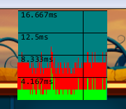

# kha-debug-stats



```haxe
class Main {
	static var stats : kha.debug.Statistics.Display;
	
	public static function main() {
		kha.System.init(..., kha.Assets.loadEverything.bind(system_initializedHandler));
	}
	
	function system_initializedHandler() {
		// logic tag
		var tickTag : kha.debug.Statistics.Tag = { id : 'tick', color : kha.Color.Green }
		
		// g4 rendering tag
		var g4Tag : kha.debug.Statistics.Tag = { id : 'g4', color : kha.Color.Red }
		
		// g2 rendering tag
		var g2Tag : kha.debug.Statistics.Tag = { id : 'g2', color : kha.Color.Blue }
		
		// 128x128 display
		var statSettings : kha.debug.Statistics.Settings = { bufferSize : 128, displayHeight : 128, tags : [tickTag, g4Tag, g2Tag] };

		stats = new kha.debug.Statistics.Display(statSettings, kha.Assets.fonts.consola);

		kha.System.notifyOnRender(render);
		kha.Scheduler.addTimeTask(tick, 0, 1 / 60);		
	}
	
	function tick() {
		var ts = kha.Scheduler.realTime();
			// make stuff happen		
		var te = kha.Scheduler.realTime();
		
		stats.updateBuffer(0, te - ts);
	}
	
	function render( fb : kha.Framebuffer ) {
		stats.nextFrame();
		
		var g4s = kha.Scheduler.realTime();
			// g4 stuff
		var g4e = kha.Scheduler.realTime();
	
		stats.updateBuffer(1, g4e - g4s);
		
		var g2s = kha.Scheduler.realTime();
			// g2 stuff
		var g2e = kha.Scheduler.realTime();

		stats.updateBuffer(2, g2e - g2s);
		
		var g2 = fb.g2;
		
		g2.begin(false);
			stats.render(g2, 4, 4);
		g2.end();
	}	
}
```
